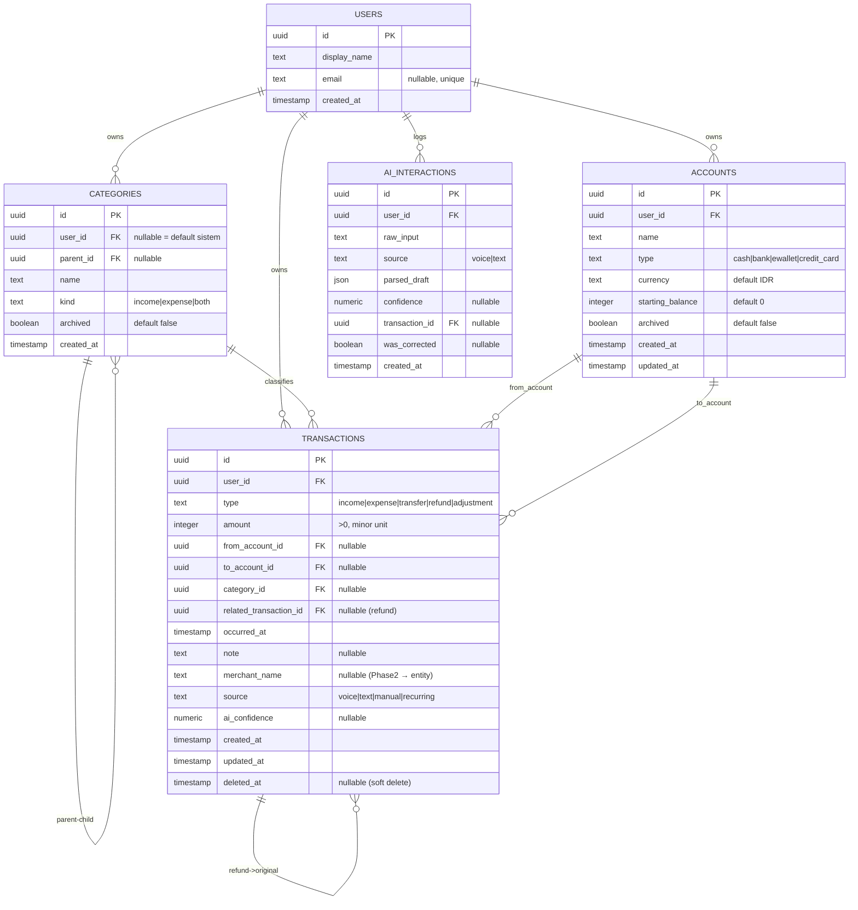

# DATABASE DESIGN — AI Financial Assistant

_Versi 1.0 · 2026-09-12 · Tahap 3: Database Design_
_Perspektif Senior System Architect. Skema **minimal** untuk MVP. Tanpa kode._

> Prinsip: **transaksi = sumber kebenaran, saldo = turunan** (DECISIONS).
> Nominal = **integer rupiah (minor unit), selalu > 0**; arah ditentukan tipe +
> peran akun (FINANCIAL_RULES §0).

---

## 1. Evaluasi Entity: MVP vs Ditunda
Prinsip: **jangan buat entity yang belum diperlukan MVP.**

| Entity | Keputusan | Alasan |
|--------|-----------|--------|
| `users` | **MVP (minimal)** | Scope kepemilikan data & future-proof multi-user; murah dibuat sekarang |
| `accounts` | **MVP** | Inti: cash/bank/e-wallet/credit card |
| `transactions` | **MVP** | Inti absolut |
| `categories` | **MVP** | Dibutuhkan untuk kategori + subkategori ("Makanan → Kopi") |
| `merchants` | **Ditunda (Phase 2)** | Cukup simpan sebagai teks `note`/`merchant_name` di transaksi dulu |
| `user_preferences` | **Ditunda (Phase 2)** | Default (akun default, ambang duplikat) di-hardcode dulu |
| `ai_interactions` | **MVP-opsional (minimal)** | Diperlukan untuk metrik akurasi/koreksi; boleh versi ringkas. Lihat §4 |
| `recurring_transactions` | **Ditunda (Phase 3)** | Fitur berulang = Phase 3 (FINANCIAL_RULES §14) |
| `budgets` | **Ditunda (Phase 3)** | Budgeting = Phase 3 |

> Rekomendasi: bangun **users, accounts, categories, transactions** sekarang;
> tambah `ai_interactions` ringkas hanya jika ingin mengukur metrik produk sejak
> awal (lihat Open Question §8).

---

## 2. ERD (MVP)

**Relasi ringkas (fallback teks):**
- `users` 1—* `accounts`, `categories`, `transactions`, `ai_interactions`
- `categories` self-referencing (`parent_id`) untuk subkategori
- `transactions.from_account_id` / `to_account_id` → `accounts`
- `transactions.category_id` → `categories`
- `transactions.related_transaction_id` → `transactions` (refund menautkan ke expense asal)

---

## 3. Pemetaan Tipe Transaksi ke Kolom from/to
Model **from/to** dipakai agar satu tabel melayani semua tipe (termasuk transfer).

| Tipe | from_account_id | to_account_id | category | Catatan |
|------|-----------------|---------------|----------|---------|
| income | — | akun asset | ya | saldo tujuan naik |
| expense (asset) | akun asset | — | ya | saldo sumber turun |
| expense (credit card) | akun CC | — | ya | utang CC naik |
| transfer | akun sumber | akun tujuan | — | net worth netral |
| bayar CC (pelunasan) | akun bank | akun CC | — | direkam sebagai **transfer** |
| refund (ke asset) | — | akun asset | ya (ikut asal) | contra-expense; `related_transaction_id` opsional |
| refund (ke CC) | akun CC | — | ya | utang CC turun |
| adjustment (naik) | — | akun | — | delta positif |
| adjustment (turun) | akun | — | — | delta negatif |

> Konsekuensi: **pembayaran kartu kredit disimpan sebagai `transfer`** (bank→CC),
> sehingga otomatis **bukan expense** — mencegah double counting di level data.

---

## 4. Detail Entity

### 4.1 users (MVP minimal)
- **PK:** `id` (uuid).
- **Field:** `display_name`, `email` (nullable, **unique** bila diisi), `created_at`.
- **Audit:** `created_at`.
- **Deletion:** MVP single-user → tidak dihapus. Multi-user nanti: hapus user =
  hapus data miliknya (cascade) — diputuskan saat auth ditambah.

### 4.2 accounts (MVP)
- **PK:** `id`. **FK:** `user_id → users.id`.
- **Field:** `name`, `type` (cash|bank|ewallet|credit_card), `currency` (default IDR),
  `starting_balance` (integer, default 0), `archived`, `created_at`, `updated_at`.
- **Klasifikasi asset/liability** diturunkan dari `type` (CC = liability) — tidak disimpan.
- **Unique:** `(user_id, name)`.
- **Index:** `(user_id)`.
- **Deletion:** **RESTRICT** bila masih direferensikan transaksi → gunakan
  `archived=true` (soft), jangan hard delete.
- **Audit:** `created_at`, `updated_at`.

### 4.3 categories (MVP)
- **PK:** `id`. **FK:** `user_id → users.id` (nullable = kategori default sistem),
  `parent_id → categories.id` (nullable, subkategori).
- **Field:** `name`, `kind` (income|expense|both), `archived`, `created_at`.
- **Unique:** `(user_id, parent_id, name)`.
- **Index:** `(user_id)`, `(parent_id)`.
- **Deletion:** **RESTRICT/archive**. Jika kategori dipakai transaksi, jangan
  hapus keras; arsipkan. (Alternatif SET NULL = transaksi jadi tak berkategori —
  lihat Open Question.)
- **Seed:** kategori default umum Indonesia (Makanan & Minuman→Kopi, Transport,
  Belanja, Tagihan, Gaji, dll.) dibuat sebagai default sistem (`user_id = null`).

### 4.4 transactions (MVP — inti)
- **PK:** `id`. **FK:** `user_id`, `from_account_id`, `to_account_id`,
  `category_id`, `related_transaction_id`.
- **Field:** `type`, `amount` (integer > 0), `occurred_at`, `note`, `merchant_name`,
  `source`, `ai_confidence`, `created_at`, `updated_at`, `deleted_at`.
- **Index:**
  - `(user_id, occurred_at)` — riwayat & laporan per periode.
  - `(from_account_id)`, `(to_account_id)` — hitung saldo per akun.
  - `(category_id)` — laporan per kategori.
  - `(related_transaction_id)` — telusur refund.
  - `(deleted_at)` — filter soft-deleted.
- **Constraint (level aplikasi/CHECK):**
  - `amount > 0`.
  - kombinasi from/to sesuai tabel §3 per tipe (divalidasi Validation Layer).
  - transfer: `from_account_id ≠ to_account_id`.
- **Deletion:** **soft delete** (`deleted_at`) demi audit & recompute konsisten.
- **Audit:** `created_at`, `updated_at`, `deleted_at`, `source`, `ai_confidence`.

### 4.5 ai_interactions (MVP-opsional, minimal)
- **Tujuan:** mengukur metrik produk (extraction accuracy, correction rate) &
  debugging prompt.
- **PK:** `id`. **FK:** `user_id`, `transaction_id` (nullable).
- **Field:** `raw_input`, `source`, `parsed_draft` (json), `confidence`,
  `was_corrected`, `created_at`.
- **Index:** `(user_id, created_at)`.
- **Deletion:** boleh dihapus/di-retensi terbatas (data bisa sensitif); tidak
  memengaruhi kebenaran finansial.
- **Catatan:** jika metrik tidak diprioritaskan di MVP, entity ini boleh ditunda.

---

## 5. Entity yang Ditunda (bentuk ringkas, untuk future-proofing)
Tidak dibuat sekarang; dicatat agar skema awal tidak menutup jalan.
- **merchants** (Phase 2): `id, user_id, name, default_category_id` — menggantikan
  `transactions.merchant_name` (teks) → `merchant_id` (FK).
- **user_preferences** (Phase 2): `user_id, default_account_id, duplicate_window_sec, locale`.
- **recurring_transactions** (Phase 3): template `type, amount, account(s), category,
  frequency, next_date, active` (FINANCIAL_RULES §14).
- **budgets** (Phase 3): `user_id, category_id, period, limit_amount`.

---

## 6. Deletion Behavior — Ringkasan
| Entity | Perilaku |
|--------|----------|
| transactions | Soft delete (`deleted_at`); tidak dihapus fisik demi audit |
| accounts | RESTRICT bila direferensikan → archive |
| categories | RESTRICT/archive bila dipakai (alternatif SET NULL, lihat Open Q) |
| ai_interactions | Boleh hard delete / retensi terbatas |
| users | (MVP) tidak dihapus; multi-user → cascade saat auth ditambah |

## 7. Audit Requirement
- Semua entity operasional punya `created_at`; yang bisa berubah punya `updated_at`.
- `transactions` menyimpan jejak: `source` (voice/text/manual/recurring),
  `ai_confidence`, `deleted_at`, dan `related_transaction_id`.
- Saldo & laporan **selalu dapat direkonstruksi** dari `transactions` yang tidak
  ter-soft-delete (menjamin konsistensi setelah edit/hapus — TC-17).

---

## 8. OPEN DATABASE QUESTIONS
Belum diputuskan — disertai rekomendasi.
1. **Sertakan `ai_interactions` di MVP?**
   → _Rekomendasi:_ ya, versi minimal, karena metrik akurasi/koreksi termasuk
   Product Success Metrics. Jika ingin ekstra ramping, tunda ke Phase 2.
2. **Perilaku hapus kategori: RESTRICT/archive atau SET NULL?**
   → _Rekomendasi:_ archive (RESTRICT hard delete) agar laporan historis tetap utuh.
3. **UUID atau integer auto-increment untuk PK?**
   → _Rekomendasi:_ UUID (aman untuk sinkronisasi/multi-perangkat nanti); integer
   juga cukup untuk single-user SQLite bila ingin lebih sederhana.
4. **Simpan saldo ter-cache di `accounts` atau selalu dihitung?**
   → _Rekomendasi:_ MVP hitung on-the-fly; tambah kolom cache hanya jika ada
   masalah performa nyata.

---

_Skema ini adalah kontrak data untuk implementasi. Perubahan skema dicatat di
`docs/DECISIONS.md` dan diikuti migrasi._
